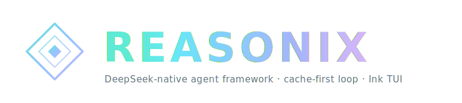

<p align="center">
  
</p>

<p align="center">
  <strong>English</strong>
  &nbsp;·&nbsp;
  <a href="./README.zh-CN.md">简体中文</a>
  &nbsp;·&nbsp;
  <a href="./docs/GUIDE.md">Guide</a>
  &nbsp;·&nbsp;
  <a href="./docs/SPEC.md">Spec</a>
</p>

<p align="center">
  <a href="./LICENSE"></a>
  <a href="https://github.com/Pro-Qin/Reasonix-SonettoHere/stargazers"></a>
</p>

<br/>

<h3 align="center">A DeepSeek-native AI coding agent — powered by Reasonix, enriched by SonettoHere.</h3>
<p align="center">A config- and plugin-driven harness — a single static Go binary, tuned around DeepSeek's prefix cache so token costs stay low across long sessions.</p>

<br/>

# 🎆 SonettoHere Integration

**Reasonix-SonettoHere** merges [SonettoHere](https://github.com/Miso2233/SonettoHere)'s rich domain-specific tool ecosystem onto [Reasonix](https://github.com/esengine/DeepSeek-Reasonix)'s rock-solid Go-native architecture.

### Built-in Tools — 30+ and growing

| Category | Tools | API Key |
|----------|-------|---------|
| 🌤️ **Weather & Calendar** | `get_current_weather`, `holiday_calendar` | `UAPIS_API_KEY` |
| 🗺️ **Map (Gaode AMAP)** | `geocode_address`, `regeocode`, `nearby_search`, `fuzzy_search_poi`, `get_transit_route`, `get_cycling_route` | `AMAP_API_KEY` |
| ✅ **Todoist Tasks** | `todoist_add`, `todoist_list_tasks`, `todoist_complete_task`, `todoist_delete_task`, `todoist_list_projects` | `TODOIST_API_TOKEN` |
| 🎮 **Entertainment** | `tarot_reading`, `answer_book` | `UAPIS_API_KEY` |
| ⏰ **System** | `current_time` | — |
| ❤️ **Health** | `health_check`, `GET /health` | — |

> API keys are optional — tools gracefully fail when unset. Set them as environment variables in your `.env` or system env.

<br/>

## Features

- **Config-driven.** Providers, the agent, enabled tools, and plugins are all
  declared in `reasonix.toml`. No hardcoded models.
- **Multi-model & composable.** DeepSeek (flash/pro) and MiMo ship as presets;
  any OpenAI-compatible endpoint is a config entry, not new code. Optionally run
  two models together (executor + planner) in separate, cache-stable sessions.
- **Plugin-driven.** External tools run as subprocesses over stdio JSON-RPC
  (MCP-compatible). Built-in tools self-register at compile time.
- **Domain tool ecosystem.** 15+ additional built-in tools for weather, maps,
  todo management, entertainment, and health monitoring — all in Go, no Python
  runtime required.

<br/>

## Install

```sh
npm i -g reasonix                  # any OS; pulls the prebuilt native binary
brew install esengine/reasonix/reasonix   # macOS
```

Prebuilt archives (`darwin|linux|windows × amd64|arm64`) and `SHA256SUMS` are on
every [GitHub release](https://github.com/Pro-Qin/Reasonix-SonettoHere/releases).

### Build from source

```sh
make build      # -> bin/reasonix(.exe)
make cross      # -> dist/ (darwin|linux|windows × amd64|arm64)
```

## Quick start

```sh
reasonix setup                      # config wizard → ./reasonix.toml
export DEEPSEEK_API_KEY=sk-...      # or let setup save it to the credential store
reasonix                            # then run /init to generate AGENTS.md (project memory)
reasonix run "implement the TODOs in main.go"
reasonix run --model mimo-pro "add unit tests for this function"
echo "explain this code" | reasonix run
```

## Configuration

A minimal `reasonix.toml` — one provider and a default model — is enough to start:

```toml
default_model = "deepseek-flash"

[[providers]]
name        = "deepseek-flash"
kind        = "openai"
base_url    = "https://api.deepseek.com"
model       = "deepseek-v4-flash"
api_key_env = "DEEPSEEK_API_KEY"
```

Resolution order is **flag > `./reasonix.toml` > the user config file >
built-in defaults**; starting with **Reasonix v1.8.1**, the user file lives at
`~/.reasonix/config.toml` on macOS/Linux and
`%AppData%\reasonix\config.toml` on Windows. See
**[Configuration paths](./docs/CONFIG_PATHS.md)** for migration details. Secrets come from the environment via `api_key_env`, are
never written to config files, and new keys default to the OS credential store
with a Reasonix-owned file fallback. Project `.env` files are read as a
compatibility override, but Reasonix does not write new keys there. Permissions, the sandbox, plugins (MCP), slash
commands, `@` references, and two-model setup are all in the
**[Guide](./docs/GUIDE.md)**.

## Documentation

- **[Guide](./docs/GUIDE.md)** — configuration, permissions & sandbox, plugins
  (MCP), slash commands, `@` references, two-model collaboration.
- **[Spec](./docs/SPEC.md)** — engineering contract: architecture, registries,
  data types, and roadmap.
- **[Checkpoints & rewind](./docs/CHECKPOINTS.md)** — the snapshot-based edit
  safety net (Esc-Esc / `/rewind`).

<br/>

---

<p align="center">
  <sub>MIT — see <a href="./LICENSE">LICENSE</a></sub>
  <br/>
  <sub>Upstream: <a href="https://github.com/esengine/DeepSeek-Reasonix">esengine/DeepSeek-Reasonix</a> · SonettoHere: <a href="https://github.com/Miso2233/SonettoHere">Miso2233/SonettoHere</a></sub>
</p>
